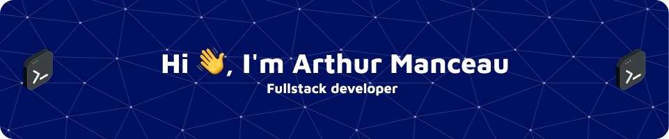

 

  

- 🔭 I’m currently working on [my portfolio](https://armanceau.netlify.app/)

- 🌱 I’m currently learning **C#, React, VueJS**

- 👨‍💻 All of my projects are available at [https://armanceau.netlify.app/](https://armanceau.netlify.app/)

- 💬 Ask me about **Figma, JS, PHP, SQL, Java, Android, ChartJS, Html/css**

- 📫 How to reach me **arthur.manceau1@outlook.fr**

- ⚡ Fun fact **: I love monkey 🐵**

<h3 align="left">Connect with me:</h3>

<h3 align="left">🧰 Languages and Tools:</h3>

<!-- 01 -->
<h4 align="left">01 - Programming Languages:</h4>
 

 

 

 

<!-- 02 -->
<h4 align="left">02 - Frontend Development:</h4>
 

 

 

 

<!-- 03 -->
<h4 align="left">03 - Database:</h4>
 

 

 

<!-- 04 -->
<h4 align="left">04 - Framework:</h4>
 

 

<!-- 05 -->
<h4 align="left">05 - Other:</h4>
 

 

 

 

 

 

 
 

 

&nbsp;

