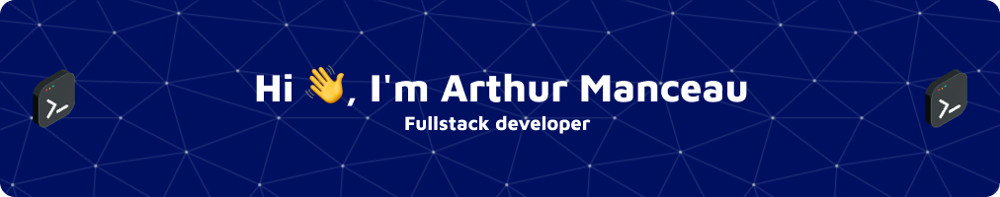

 

  

- 🌱 I’m currently learning **React, React-Native**

- 📫 How to reach me **arthur.manceau1@outlook.fr**

- ⚡ Fun fact **: I love monkey 🙊**

## Connect with me

<!-- 01 -->
## Languages
 
 
 
 

<!-- 02 -->
## Frameworks
 
 
 
 
 

<!-- 03 -->
## Databases
 
 
 

<!-- 04 -->
## Design
 
 
 

<!-- 05 -->
## Other
 
 
 

# 📊 GitHub Stats:

 

## 🏆 GitHub Trophies

### 🔝 Top Contributed Repo

